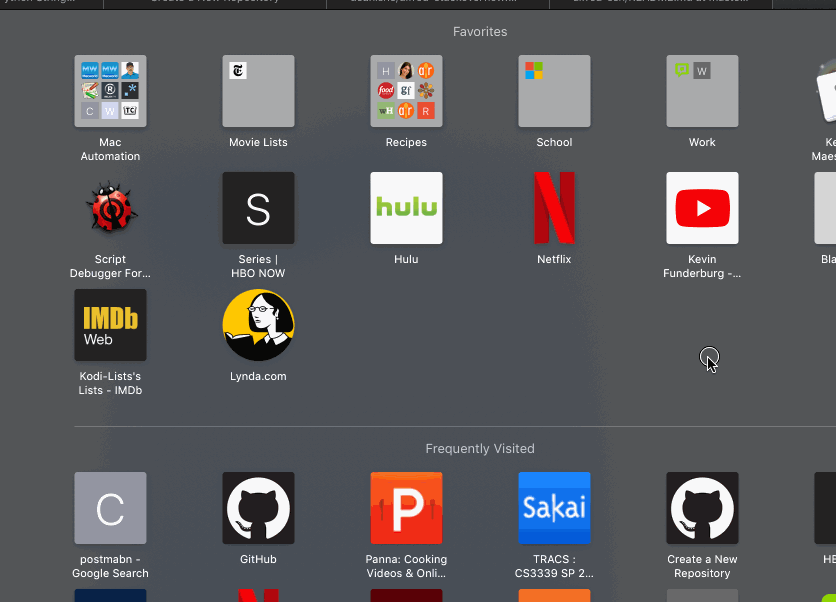

View Your BetterTouchTool Gestures With Alfred
==============================================

Use Alfred to get a quick look at all your BetterTouchTool gestures.

Note
------
- 	This does depend on your presets being exported, so the way I do it is by exporting the master preset within BTT, the renaming that resulting to file from 'Master Preset.btt' to Master Preset.json, then placing the resulting file within the workflow folder.
- 	I have a script (updatePresets.scpt)within to automate that process if the presets need to be updated as gestures are added, but it depends a lot on UI interaction so use at your own risk.
